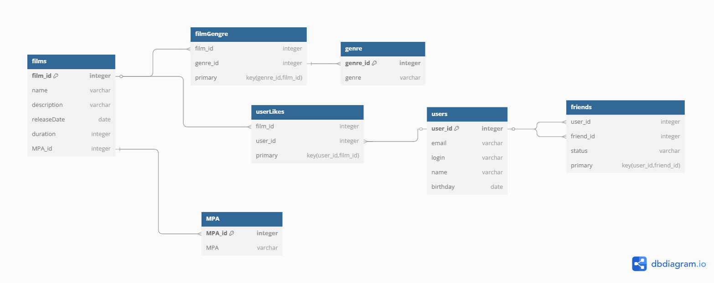

# Filmorate

**Filmorate** — это приложение для работы с фильмами, позволяющее добавлять, обновлять и просматривать фильмы.

## ER-диаграмма

---

## Описание схемы

Эта база данных предназначена для хранения информации о фильмах, пользователях и их взаимодействии с фильмами и другими пользователями.

### Таблицы

#### `films`
Хранит информацию о фильмах.

| Поле          | Тип            | Описание                          |
|---------------|-----------------|-----------------------------------|
| `film_id`     | integer (PK)     | Уникальный идентификатор фильма   |
| `name`        | varchar          | Название фильма                   |
| `description` | varchar          | Описание фильма                   |
| `releaseDate` | date             | Дата выхода фильма                |
| `duration`    | integer          | Длительность фильма (минуты)       |
| `MPA_id`      | integer (FK)      | Ссылка на возрастной рейтинг      |

---

#### `MPA`
Справочник возрастных рейтингов фильмов.

| Поле      | Тип            | Описание                             |
|-----------|-----------------|--------------------------------------|
| `MPA_id`  | integer (PK)     | Уникальный идентификатор рейтинга   |
| `MPA`     | varchar          | Название рейтинга (например, PG-13) |

---

#### `genre`
Справочник жанров фильмов.

| Поле       | Тип            | Описание                        |
|------------|-----------------|---------------------------------|
| `genre_id` | integer (PK)     | Уникальный идентификатор жанра |
| `genre`    | varchar          | Название жанра                  |

---

#### `filmGenre`
Связующая таблица "многие ко многим" между фильмами и жанрами.

| Поле       | Тип            | Описание                      |
|------------|-----------------|-------------------------------|
| `film_id`  | integer (FK)     | Идентификатор фильма          |
| `genre_id` | integer (FK)     | Идентификатор жанра           |

> **Primary Key:** составной (`genre_id`, `film_id`)

---

#### `users`
Хранит информацию о пользователях.

| Поле       | Тип            | Описание                       |
|------------|-----------------|--------------------------------|
| `user_id`  | integer (PK)     | Уникальный идентификатор пользователя |
| `email`    | varchar          | Электронная почта пользователя |
| `login`    | varchar          | Логин пользователя             |
| `name`     | varchar          | Имя пользователя               |
| `birthday` | date             | Дата рождения пользователя     |

---

#### `userLikes`
Таблица лайков фильмов пользователями.

| Поле       | Тип            | Описание                         |
|------------|-----------------|----------------------------------|
| `film_id`  | integer (FK)     | Идентификатор фильма             |
| `user_id`  | integer (FK)     | Идентификатор пользователя      |

> **Primary Key:** составной (`user_id`, `film_id`)

---

#### `friends`
Таблица дружеских связей между пользователями.

| Поле       | Тип            | Описание                         |
|------------|-----------------|----------------------------------|
| `user_id`  | integer (FK)     | Идентификатор пользователя       |
| `friend_id`| integer (FK)     | Идентификатор друга              |
| `status`   | varchar          | Статус дружбы (pending, accepted) |

> **Primary Key:** составной (`user_id`, `friend_id`)

---

## Связи между таблицами

- `films.MPA_id` → `MPA.MPA_id`
- `filmGenre.film_id` → `films.film_id`
- `filmGenre.genre_id` → `genre.genre_id`
- `userLikes.film_id` → `films.film_id`
- `userLikes.user_id` → `users.user_id`
- `friends.user_id` → `users.user_id`
- `friends.friend_id` → `users.user_id`

---

## Возможности

- Управление фильмами и их жанрами.
- Отслеживание лайков фильмов пользователями.
- Добавление друзей между пользователями.
- Поддержка возрастных рейтингов для фильмов.

